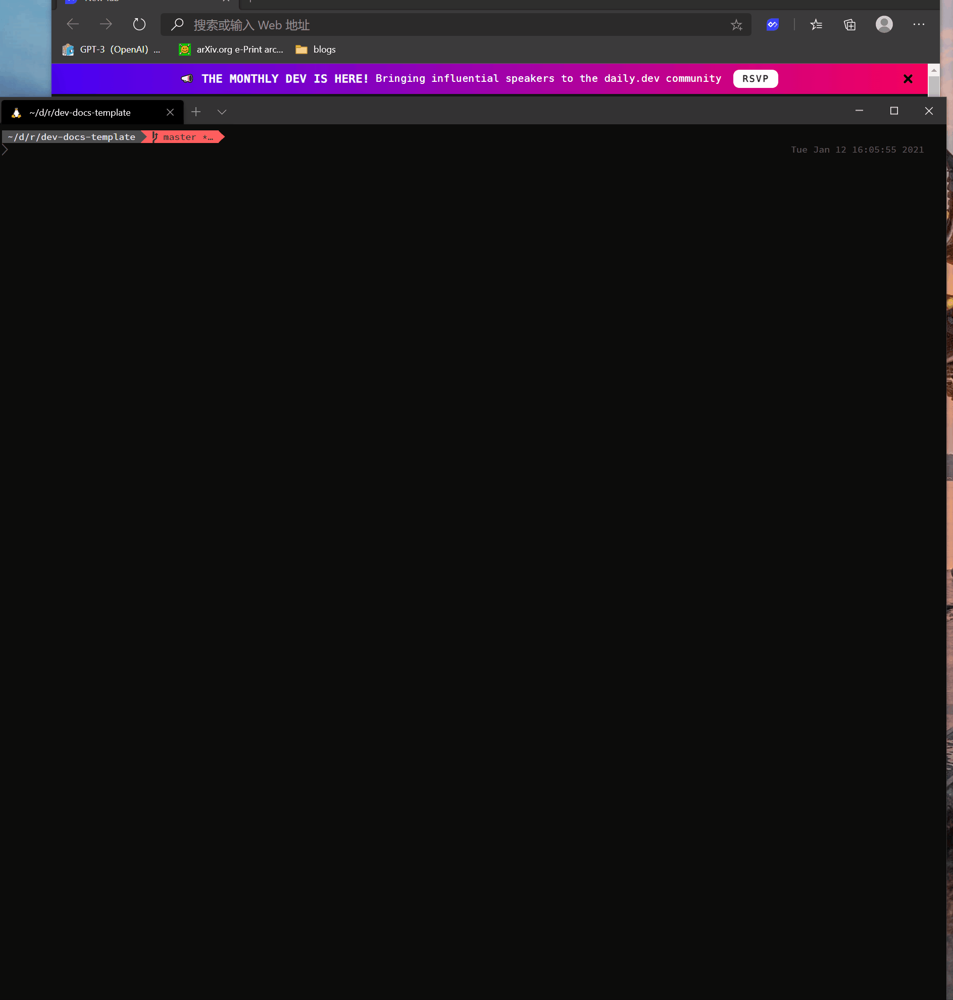

# Build Your Doc Sites

After editing docs in the VSCode Remote Container environment, you can build or preview your docs site with several ways.

## Preview Your Document Sites with Local Server

You can preview your document sites locally by running a docker container to host your markdown documents.
Run this command:

```bash
make preview
```

Then a VuePress dev server will be started and listened at $VUEPRESS_PREVIEW_PORT port value defined in `./.env`, default 8081)
And you can check the docs in a browser with the url localhost:$VUEPRESS_PREVIEW_PORT`.

After preview, stop by

```bash
make stop-preview
```



##  Build Your Document Sites

Run this command:

```bash
make build
```

The built result is in `$DOCS_RELATIVE_PATH/.vuepress/dist` (defined in `./.env`, default `docs_src`).

This result is also offlinified by `./docker/offlinify.js` so that support `file://` access, which means 
that you can package `$DOCS_RELATIVE_PATH/.vuepress/dist` into a zip file and distributed it as an offline documentation. (Please noted that search is not support when using file:// access).

::: warning
Please noticed that current `./docker/offlinify.js` only supports current directory structure. Please modify the js file when you use other VuePress theme or use untested directory structure.
:::

## Export Your Site as a Single PDF File

```bash
make pdf
```

The built result is in `$DOCS_RELATIVE_PATH/site.pdf` (defined in `./.env`, default `docs_src`).