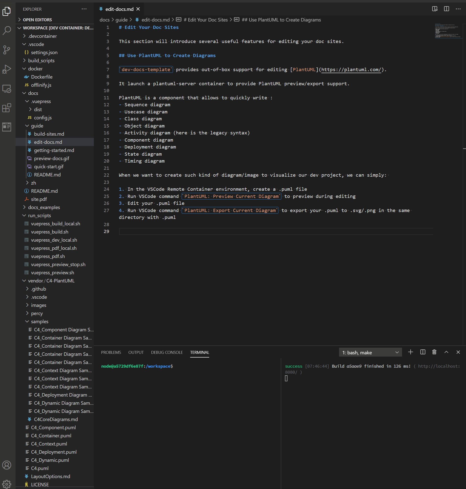
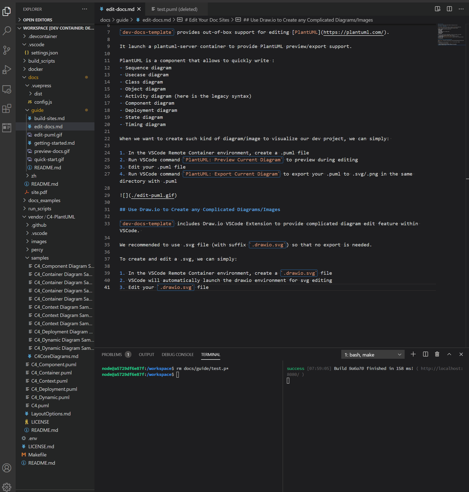

# Edit Your Doc Sites

This section will introduce several useful features for editing your doc sites.

## Use PlantUML to Create Diagrams

`dev-docs-template` provides out-of-box support for editing [PlantUML](https://plantuml.com/).

It launch a plantuml-server container to provide PlantUML preview/export support.

PlantUML is a component that allows to quickly write :
- Sequence diagram
- Usecase diagram
- Class diagram
- Object diagram
- Activity diagram (here is the legacy syntax)
- Component diagram
- Deployment diagram
- State diagram
- Timing diagram

When we want to create such kind of diagram/image to visualize our dev project, we can simply: 

1. In the VSCode Remote Container environment, create a .puml file
2. Run VSCode command `PlantUML: Preview Current Diagram` to preview during editing
3. Edit your .puml file
4. Run VSCode command `PlantUML: Export Current Diagram` to export your .puml to .svg/.png in the same directory with .puml



## Use Draw.io to Create any Complicated Diagrams/Images

`dev-docs-template` includes Draw.io VSCode Extension to provide complicated diagram edit feature within VSCode. 

We recommended to use .svg file (with suffix `.drawio.svg`) so that no export is needed.

To create and edit a .svg, we can simply:

1. In the VSCode Remote Container environment, create a `.drawio.svg` file
2. VSCode will automatically launch the drawio environment for svg editing
3. Edit your `.drawio.svg` file



## Configurate Navbar/Sidebar

The default sites use VuePress default theme, which include the Navbar/Sidebar features.

Relative configuration file is in `$DOCS_RELATIVE_PATH/.vuepress/config.js` (`$DOCS_RELATIVE_PATH` defined in `./.env`, default `docs_src`).

Please check these highlighted parts

```js{7-21}
themeConfig: {
        sidebar: 'auto',
        locales: {
            '/': {
                selectText: 'Languages',
                label: 'English',
                nav: [
                    { text: 'Home', link: '/' },
                    { text: 'Guide', link: '/guide/index.html' },
                    { text: 'GitHub', link: 'https://github.com/lisy09/dev-docs-template' },
                ],
                sidebar: {
                    '/guide/': [ 
                        {
                            title: 'Guide',
                            collapsable: true,
                            children: [
                                '',
                                'getting-started',
                                'edit-docs',
                                'build-sites'
                            ]
                        }
                    ],
                }
            },
```

For further information, please check VuePress official documents about [Navbar](https://vuepress.vuejs.org/theme/default-theme-config.html#navbar) and [Sidebar](https://vuepress.vuejs.org/theme/default-theme-config.html#sidebar).